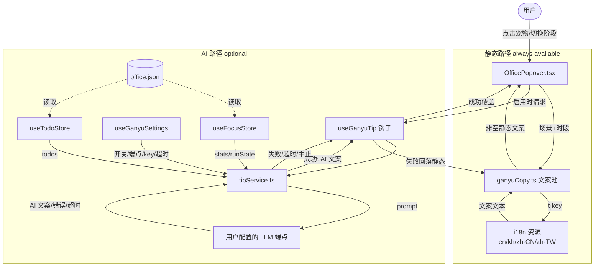
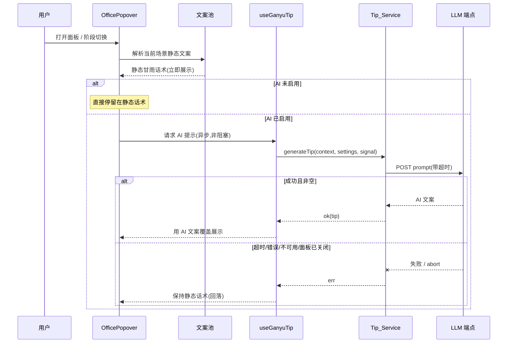

# Design Document

## Overview

本设计为 WindowPet 工作面板(`OfficePopover`)引入桌宠"甘雨"的人设文案体系。整体采用**双路文案**架构,这也是本设计的核心:

- **路径一 · 静态甘雨话术(Static_Copy)**:始终可用的基础层。一套精心撰写、按场景组织的甘雨口吻文案池,通过现有 i18n 机制(`t()`)提供,覆盖时段问候、专注阶段标签、事件文案、引导页、按钮/标题/占位符、底部统计标签等。**不依赖网络,默认且永远可用**。
- **路径二 · AI 个性化话术(AI_Tip)**:可选的增强层。当用户启用并配置了 LLM 服务后,`Tip_Service` 读取本地 `Office_Data` 与当前时段,构造提示词调用用户配置的模型端点,异步生成一条甘雨口吻的"贴心提示"。

两条路径的关系必须明确:**静态话术是地基与兜底,AI 话术是叠加在其上的可选增强**。任何时刻——AI 未启用、正在加载、超时、报错、端点不可用——界面都会回落到对应场景的静态甘雨话术,因此用户永远能看到一条符合人设的、非空的文案。

本设计覆盖需求文档的两个阶段:阶段一(需求 1–6,静态文案)是阶段二(需求 7–10,AI 提示)的前提与兜底。

### 设计目标

1. 把面板中现有的中性/硬编码文案,替换为甘雨口吻、可多语言、可轮换的文案。
2. 文案以稳定 key 接入 i18n,en/kh/zh-CN/zh-TW 一一对应,缺失回退 en。
3. AI 提示作为非阻塞、可降级、隐私可控的增强,失败时无缝回落静态文案。
4. 把"文案解析"与"AI 调用"抽成可独立测试的纯逻辑模块,便于属性测试。

## Architecture

### 模块划分

在现有结构上新增三块,并改造 `OfficePopover`:

- `src/ui/office_popover/ganyuCopy.ts` —— **静态文案池模块**(纯逻辑)。定义场景枚举、文案 key 方案、时段计算、轮换选取逻辑。所有文案文本本身存于 i18n 资源,模块只负责"场景 → key 列表 → 选出一条 key → `t(key)`"。
- `src/services/tipService.ts` —— **Tip_Service**(AI 路径)。负责读取 `Office_Data`、序列化上下文、构造提示词、调用 LLM、超时/中止/去重、把结果或错误交还给调用方。纯网络与编排逻辑,不直接操作 DOM。
- `src/hooks/useGanyuSettings.tsx` —— **Ganyu_Settings**(zustand store + 持久化)。管理 AI 开关、端点、API key、超时、提醒阈值、首启说明是否已展示等,持久化到 `settings.json` 的新 `ganyu` 段(沿用 `getAppSettings`/`setConfig`)。
- `OfficePopover.tsx` —— 改造为:渲染时先调用文案池得到静态文案;若 AI 启用则通过一个 `useGanyuTip` 钩子异步获取 AI 提示,成功则覆盖展示,否则保持静态文案。

i18n 资源文件(`src/locale/{en,kh,zh-CN,zh-TW}/translation.json`)新增甘雨文案条目;`office.json` 结构不变(仅被 Tip_Service 读取)。

### 组件交互图



### 渲染与降级时序



## Components and Interfaces

### 1. 静态文案池模块 `ganyuCopy.ts`

负责把"场景"映射到一组 i18n key,并按需选出一条返回 key(由调用方 `t()`)。文本不在此硬编码。

```ts
// 时段
export type TimeSegment = "dawn" | "morning" | "noon" | "afternoon" | "evening";

// 场景:覆盖需求 2/3/4/5 的全部展示位
export type CopyScene =
  | { kind: "greet"; segment: TimeSegment }            // 时段问候(需求2)
  | { kind: "phaseLabel"; phase: FocusPhase }          // 专注阶段标签(需求3)
  | { kind: "subtitleIdlePending" }                    // idle 且有未完成待办的副标题引导(需求4.3)
  | { kind: "subtitleDefault" }                        // 一般副标题
  | { kind: "todoCelebrate" }                          // 完成任务赞美(需求4.1)
  | { kind: "todoEmpty" }                              // 空状态关怀(需求4.2)
  | { kind: "focusStart" }                             // 开始专注鼓励
  | { kind: "focusBreak" }                             // 进入休息提示
  | { kind: "longWorkCare" }                           // 长时间工作关心
  | { kind: "onboardGreet" } | { kind: "onboardHint" }; // 引导页(需求5)

// 由当前小时计算时段;保留现有边界 5/11/14/18(需求2.6)
export function getTimeSegment(hour: number): TimeSegment;

// 返回某场景下的全部候选 i18n key(稳定、有序)
export function sceneKeys(scene: CopyScene): string[];

// 从候选 key 中选一条(支持轮换/随机;seed 便于测试可重现)
export function pickKey(keys: string[], seed?: number): string;

// 便捷封装:场景 → 选定 key → t(key)。t 由调用方注入(react-i18next)
export function resolveCopy(
  scene: CopyScene,
  t: (k: string) => string,
  seed?: number
): string;
```

**关键约束**:`sceneKeys` 对任何合法场景都返回**非空**数组;`resolveCopy` 永远返回非空字符串(地基保证)。

### 2. Tip_Service `tipService.ts`

```ts
export interface TipContext {
  segment: TimeSegment;
  nowISO: string;
  todos: { text: string; completed: boolean }[];
  todayPomodoros: number;
  todayFocusSeconds: number;
  phase: FocusPhase;
  completedPomodoros: number;
  continuousFocusSeconds: number; // 用于长时间工作提醒阈值判断(需求7.3)
}

export interface TipResult {
  ok: boolean;
  tip?: string;        // 成功时的 AI 文案(已裁剪到长度上限)
  reason?: "disabled" | "timeout" | "network" | "bad_response" | "aborted" | "no_config";
}

// 构造发往 LLM 的请求体(systemPrompt + userPrompt),纯函数,便于测试
export function buildPrompt(ctx: TipContext): { system: string; user: string };

// 把上下文裁剪/序列化为可发送内容(隐私边界:仅 todo 文本+完成态、统计、运行态、时段)
export function serializeContext(ctx: TipContext): TipContext;

// 主入口:异步、可中止、含超时;不抛异常,失败以 TipResult.ok=false 返回
export async function generateTip(
  ctx: TipContext,
  settings: GanyuSettings,
  signal: AbortSignal
): Promise<TipResult>;
```

行为约束:
- `settings.aiEnabled === false` → 立即返回 `{ ok:false, reason:"disabled" }`,**不读取数据、不发请求**(需求8.2)。
- 缺少端点/key 或本地存储不可用 → `{ ok:false, reason:"no_config" }`(需求8.7)。
- 请求仅发往 `settings.endpoint`,不向任何其他地址发送(需求8.8)。
- 超时(`settings.timeoutMs`)、网络错误、空/非法响应 → 对应 `reason`,均视为失败由调用方回落静态。
- 成功响应若超过长度上限按 30 汉字裁剪(需求7.5/1.5)。

### 3. AI 提示钩子 `useGanyuTip`

封装"调用 + 去重 + 中止 + 回落"的 React 逻辑,供 `OfficePopover` 使用。

```ts
function useGanyuTip(args: {
  enabled: boolean;
  scene: CopyScene;          // 用于回落与去重 key
  buildContext: () => TipContext;
  fallback: string;          // 来自文案池的静态话术
}): { text: string; loading: boolean };
```

- 打开面板与阶段切换时触发(需求9.1/9.2);相同上下文不重复请求(需求10.4,以场景+关键数据指纹去重)。
- 初始 `text === fallback`(先展示静态,需求9.5);成功后切换为 AI 文案。
- 组件卸载/面板关闭时 `AbortController.abort()`,忽略迟到结果(需求10.3)。

### 4. Ganyu_Settings `useGanyuSettings.tsx`

zustand store,持久化于 `settings.json` 的 `ganyu` 段,UI 在 Office 设置页编辑。

```ts
interface GanyuSettings {
  aiEnabled: boolean;        // 默认 false(需求8.1)
  endpoint: string;          // 用户配置端点(需求8.5)
  apiKey: string;            // 本地存储,UI 掩码回显(需求8.6)
  model?: string;
  timeoutMs: number;         // 可配置超时(需求10.2),默认如 8000
  longWorkThresholdSeconds: number; // 长时间工作提醒阈值(需求7.3)
  disclosureShown: boolean;  // 首启数据使用说明是否已展示(需求8.4)
}
```

接口:`loadSettings()`、`updateSettings(partial)`、`enableAi()`(首次启用时置位 `disclosureShown` 并触发说明展示)、`maskedApiKey()`(仅返回如 `sk-****abcd`)。

### 5. i18n key 方案

采用稳定、带命名空间前缀的英文 key(避免用中文文案当 key,便于多语言一一对应,满足需求6.5)。所有 key 在四个语言资源中均需存在;缺失由 i18next `fallbackLng: 'en'` 兜底(需求6.3)。

```
ganyu.greet.dawn.1 / .2 / .3
ganyu.greet.morning.1 ...
ganyu.greet.noon.* / afternoon.* / evening.*
ganyu.phase.working.* / shortBreak.* / longBreak.* / idle.*
ganyu.event.celebrate.*      // 完成任务赞美
ganyu.event.empty.*          // 空状态关怀
ganyu.event.focusStart.*     // 开始专注
ganyu.event.break.*          // 进入休息
ganyu.event.longWork.*       // 长时间工作关心
ganyu.subtitle.idlePending.* // idle 有未完成待办引导
ganyu.subtitle.default.*
ganyu.onboard.greet.* / ganyu.onboard.hint.*
ganyu.btn.start / pause / reset / setCurrent / delete / setDefault   // 控件 title/placeholder
ganyu.placeholder.addTodo
ganyu.footer.pomodoros / ganyu.footer.minutes                        // 底部统计标签
```

同一场景的多个 `.1/.2/.3` 为可轮换变体,使文案"常看常新"。

## Data Models

### 文案池结构(逻辑模型)

文案池是"场景 → 有序 key 列表"的映射;文本存于 i18n 资源。结构上每个场景至少 1 条、问候/事件类建议 3 条以上变体。

| 场景 kind | key 前缀 | 变体数(建议) |
|---|---|---|
| greet(5 个时段) | `ganyu.greet.<segment>` | 每段 ≥3 |
| phaseLabel(4 个阶段) | `ganyu.phase.<phase>` | 每阶段 ≥2 |
| todoCelebrate | `ganyu.event.celebrate` | ≥4 |
| todoEmpty | `ganyu.event.empty` | ≥2 |
| focusStart / focusBreak / longWorkCare | `ganyu.event.*` | ≥2 |
| subtitleIdlePending / subtitleDefault | `ganyu.subtitle.*` | ≥2 |
| onboardGreet / onboardHint | `ganyu.onboard.*` | ≥1 |
| 控件/占位/统计标签 | `ganyu.btn.* / placeholder.* / footer.*` | 1(固定) |

### Ganyu 设置 schema(持久化于 settings.json → `ganyu`)

```json
{
  "ganyu": {
    "aiEnabled": false,
    "endpoint": "",
    "apiKey": "",
    "model": "",
    "timeoutMs": 8000,
    "longWorkThresholdSeconds": 5400,
    "disclosureShown": false
  }
}
```

### AI 提示词 / 响应模型

**System Prompt(强制甘雨人设 + 长度 + 语气约束)**,大意为(实际写入资源/常量):

> 你是桌面伴侣"甘雨",温柔、勤勉、贴心的秘书。请用第二人称"你"称呼主人、第一人称"我"指代自己,给出**一句**贴心提示。只表达一个意图,使用陈述或邀请语气,不要命令、不要寒暄堆砌、不加表情符号与引号,**不超过 30 个汉字**。

**User Prompt** 由 `TipContext` 序列化拼装,仅含:时段与当前时间、待办文本与完成状态、今日番茄数/专注秒数、当前阶段与已完成番茄数、连续专注时长。**不包含**任何设备标识、文件路径或其他个人信息(隐私边界)。

**响应处理模型**:取模型输出首个非空行 → 去除引号/多余空白 → 若 > 30 汉字则截断 → 作为 `TipResult.tip`;空响应记为 `bad_response` 失败。

### 关键数据流与隐私边界

- 发送的数据严格限定为上面 User Prompt 列举字段(需求7.1/7.2、8.3)。
- `aiEnabled=false` 时整条 AI 数据流不启动(需求8.2)。
- `apiKey` 仅存本地 `settings.json`,UI 通过 `maskedApiKey()` 掩码(需求8.6)。

## 两条消息路径与示例文案

> 撰写依据见角色 Skill 文档:`.kiro/steering/ganyu-persona.md`。
> 核心人设要点(撰写时务必体现):月海亭秘书出身、半麒麟仙兽血脉、温柔娴静而内向、勤勉尽责且自己也常因工作过劳——因此她的关怀来自**共情**而非说教;可适度点缀世界观意象(契约、卷宗、清心花、霜雪、热茶、小憩、璃月),但点到为止、不堆砌。所有文案第二人称「你」、第一人称「我」,≤30 汉字,温柔陈述/邀请语气,不命令、不催促、不堆叹号、不滥用表情。

### 路径一:无模型服务时——静态甘雨话术(默认 / 兜底)

这是面板默认且永远可用的文案来源。下列为各场景的甘雨口吻示例变体,实际写入 i18n 资源,多条用于轮换,使文案"常看常新"。

时段问候(需求2):
- 凌晨(0–4):`夜深了,我陪你再批完最后一卷。` / `这么晚还在忙,也要记得照顾自己。` / `星子都歇下了,你别太勉强自己。`
- 早上(5–10):`早安,晨露未干,我们慢慢开始。` / `早上好,先深呼吸一口,再出发。` / `你来啦,今日也请多多指教。`
- 中午(11–13):`日头正中,先用些饭、歇口气吧。` / `午间了,补充些气力再继续。` / `这个时辰,我陪你松一松肩。`
- 下午(14–17):`下午好,我替你沏了杯清心茶。` / `午后易倦,我陪你慢慢提神。` / `阳光斜下来了,再稳稳走一段。`
- 晚上(18–23):`入夜了,今日也辛苦你了。` / `晚上好,把脚步放缓一些吧。` / `灯火亮起,该让自己歇歇了。`

专注阶段标签(需求3):
- working:`专注中` / `我陪你一同专心`
- shortBreak:`小憩片刻` / `先歇一会儿吧`
- longBreak:`好好休息` / `这次,多歇一会儿`
- idle:`准备开始` / `随时可以出发`

事件文案:
- 完成任务赞美(需求4.1):`又妥帖收尾一件,你真的很棒。` / `这一项交给你,我很放心。` / `稳稳推进,我都替你高兴。` / `如约完成,做得很好。`
- 空状态关怀(需求4.2):`还没有事项呢,想做的告诉我,我替你记着。` / `把要做的交给我,你只管安心。`
- 开始专注(focusStart):`坐稳了,我陪你静下心来。` / `从此刻起,只看眼前这一件。`
- 进入休息(focusBreak):`这一程辛苦了,先松口气。` / `起身走两步,我在这儿等你。`
- 长时间工作关心(longWorkCare):`你已忙了很久,先喝口热茶吧。` / `我也常忘了歇,所以更想你歇歇。` / `案牍劳形,该让自己缓一缓了。`

副标题引导(需求4.3,idle 且有未完成待办):`先从你最挂心的那件开始吧。` / `挑一件,我们一起把它做完。`

引导页(需求5):
- onboardGreet:`初次见面,我是甘雨,往后请多关照。`
- onboardHint:`选一处常用的案头,我会记住你的偏好。` / `之后在顶上随时都能切换。`

控件/占位/统计标签(需求4.4/4.5):
- 占位符:`写下一件想做的事…`
- 控件 title:开始`开始吧`、暂停`先停一下`、重置`重新来过`、设为当前`就先做这件`、删除`这件先放下`、设为默认`记住这处案头`
- 底部统计:`今日专注` / `分钟`

### 路径二:有模型服务时——AI 个性化话术(可选增强)

当 `aiEnabled=true` 且端点/key 已配置:面板打开或阶段切换时,先展示路径一的静态话术,同时 `Tip_Service` 异步用 `TipContext` 调用模型,生成一条更贴合当下状态的"贴心提示"覆盖展示。

System Prompt 须把上方人设(月海亭秘书、半麒麟、温柔内向、勤勉而易过劳、共情式关怀、世界观意象点到为止)、长度(≤30 汉字)、人称与语气约束完整注入,使 AI 文案与静态话术风格一致。示例:

- 午后 + 3 项未完成:`下午好,先把那件搁最久的卷宗收尾吧。`
- 连续专注超阈值:`你已专注一个多时辰,先歇五分钟好吗。`
- 今日已完成多个番茄:`今日已很高效了,我打心底为你高兴。`
- 深夜仍有未完成 + 长时间工作:`夜已深,这件明日再续,先去歇着吧。`

无论何种原因(未启用 / 加载中 / 超时 / 报错 / 端点不可用),都回落到路径一对应场景的静态话术——**用户永远看到一条合规、非空、符合甘雨人设的文案**。AI 路径只是锦上添花,人设的"地基"始终由路径一守住。

## Correctness Properties

*属性(property)是指在系统所有合法执行中都应成立的特征或行为——即关于系统"应当做什么"的形式化陈述。属性是人类可读规范与机器可验证正确性保证之间的桥梁。*

下列属性均经前述 prework 分析与去重得出。语气、温柔感等主观文案质量不可计算,通过人工审阅与撰写规范保证,不列为属性。

### Property 1: 任意场景总能解析出非空文案

*For any* 合法的 `CopyScene`(含时段问候、专注阶段标签、完成赞美、空状态关怀、开始专注、进入休息、长时间工作关心、副标题引导、引导页、控件/占位/统计标签),`sceneKeys(scene)` 返回非空 key 列表,且 `resolveCopy(scene, t)` 返回非空字符串。

**Validates: Requirements 3.1, 3.2, 3.3, 3.4, 4.1, 4.2, 4.3, 4.4, 4.5, 5.1, 5.2, 5.3**

### Property 2: 时段映射正确且问候非空

*For any* 小时数 `hour ∈ [0,23]`,`getTimeSegment(hour)` 落入正确区间(0–4→凌晨、5–10→早上、11–13→中午、14–17→下午、18–23→晚上,边界 5/11/14/18),且对应 `greet` 场景能解析出非空问候文案。

**Validates: Requirements 2.1, 2.2, 2.3, 2.4, 2.5, 2.6**

### Property 3: 文案长度约束(静态与 AI 一致)

*For any* 合法场景的静态文案,以及 *for any* 模型返回的任意字符串经裁剪后的 AI_Tip,其长度均不超过 30 个汉字。

**Validates: Requirements 1.5, 7.5**

### Property 4: 文案 key 的多语言完整性

*For any* 文案池声明使用的 i18n key,en、kh、zh-CN、zh-TW 四种语言资源中均存在该 key 且对应文案非空。

**Validates: Requirements 6.2, 6.5**

### Property 5: 停用 AI 时零数据读取与零网络请求

*For any* `TipContext`,当 `settings.aiEnabled === false` 时,`generateTip` 不发起任何网络请求(网络调用次数为 0),并返回 `reason="disabled"`。

**Validates: Requirements 8.2**

### Property 6: 启用 AI 时仅向用户配置端点发送

*For any* `TipContext` 与任意端点字符串,当 AI 已启用并发起请求时,实际请求的 URL 恒等于 `settings.endpoint`,不会发往任何其他地址。

**Validates: Requirements 8.8**

### Property 7: API key 掩码不泄露完整明文

*For any* 非空 API key 字符串,`maskedApiKey()` 的返回值不等于原始 key,且不包含原始 key 的完整连续明文(至多暴露尾部少量字符)。

**Validates: Requirements 8.6**

### Property 8: 提示词包含且仅包含约定上下文字段

*For any* `TipContext`,`buildPrompt(ctx).user` 包含待办文本与完成状态、今日番茄数、今日专注秒数、当前阶段、已完成番茄数、当前时间与时段;且不包含约定字段以外的任何信息(无设备标识、文件路径等)。

**Validates: Requirements 7.1, 7.2**

### Property 9: 未启用或失败时回落到非空静态文案

*For any* `TipContext` 与任意失败/未启用情形(`disabled`、`timeout`、`network`、`bad_response`、`aborted`、`no_config`),`useGanyuTip` 最终展示的文本恒等于传入的静态 `fallback`,且该文本非空。

**Validates: Requirements 9.3, 9.4**

### Property 10: 加载先静态、成功后更新

*For any* 场景,`useGanyuTip` 的初始展示文本等于静态 `fallback`;当 AI 成功返回非空响应后,展示文本更新为裁剪后的 AI_Tip。

**Validates: Requirements 9.5**

### Property 11: 任意超时值仍发起请求且超时后降级

*For any* `timeoutMs > 0`(含极小值),启用状态下 `generateTip` 仍会发起一次请求;若模型未在期限内响应,则返回 `reason="timeout"`,调用方据此回落静态文案。

**Validates: Requirements 10.2**

### Property 12: 关闭面板后放弃未完成请求

*For any* `TipContext`,若在请求 pending 期间触发 `abort`,则该次结果被忽略(返回 `reason="aborted"`,不更新展示),最终展示保持为静态 `fallback`。

**Validates: Requirements 10.3**

### Property 13: 同一上下文去重

*For any* `TipContext`,在单次面板打开内对相同上下文指纹连续发起 N 次请求,实际网络调用次数为 1。

**Validates: Requirements 10.4**

## Error Handling

| 场景 | 处理策略 | 用户可见结果 |
|---|---|---|
| AI 未启用 | `generateTip` 立即返回 `disabled`,不读数据不发请求 | 静态甘雨话术 |
| 端点/key 缺失或本地存储不可用 | 返回 `no_config`;`enableAi` 在存储失败时拒绝启用并保持 `aiEnabled=false` | 静态话术;设置页提示配置缺失 |
| 网络错误 | 捕获异常,返回 `network` | 回落静态话术 |
| 请求超时 | `AbortController` + 定时器,到时中止,返回 `timeout` | 回落静态话术 |
| 模型空/非法响应 | 校验失败返回 `bad_response` | 回落静态话术 |
| 面板关闭/组件卸载 | `abort()` 当前请求,忽略迟到结果,返回 `aborted` | 保持已展示的静态话术 |
| i18n 缺失某 key | i18next `fallbackLng:'en'` 回退 | 展示英文对应文案 |
| `office.json` 读取失败 | Tip_Service 以空 todos/默认 stats 构造上下文,或直接回落静态 | 静态话术 |

原则:**任何 AI 路径错误都不抛到 UI**,统一转为"回落静态话术",保证面板始终可用、始终有合规文案(对应 Property 9)。

## Testing Strategy

### 双轨测试

- **单元/示例测试**:具体场景、边界、错误条件、UI 行为与配置默认值。
  - `getTimeSegment` 边界点(0/4/5/10/11/13/14/17/18/23)。
  - 默认 `aiEnabled=false`(需求8.1)、首启说明状态机(8.3/8.4)、存储失败阻止启用(8.7)。
  - i18next 缺 key 回退 en(6.3)、切换语言重渲染(6.4)。
  - 打开面板/阶段切换触发一次请求(9.1/9.2)。
  - 长时间工作阈值与未完成待办的上下文/回落场景选择(7.3/7.4)。
- **属性测试**:覆盖上节 13 条属性的通用正确性。

### 属性测试框架与规范

- 选用 **fast-check**(与 Vitest 集成,匹配现有 `src/__tests__` 测试栈),不自行实现属性测试框架。
- 每条属性以**单个**属性测试实现,最少 **100** 次迭代(`{ numRuns: 100 }`)。
- 每个属性测试以注释标注来源,格式:
  `// Feature: ganyu-companion-messages, Property {number}: {property_text}`
- 生成器要点:
  - `CopyScene` 生成器需覆盖全部 `kind` 与全部 `TimeSegment`/`FocusPhase`,使 Property 1 全面。
  - `hour` 生成 `[0,23]` 整数,确保覆盖时段边界(Property 2)。
  - AI 响应生成器需包含超长字符串、空串、含引号/换行、非 ASCII,验证裁剪与 `bad_response`(Property 3/10)。
  - `endpoint`/`apiKey` 生成任意字符串,验证 Property 6/7。
  - 网络层用 mock(`vi.fn()`)以零成本运行 100+ 次,统计调用次数与 URL(Property 5/6/11/12/13)。

### Mock 与隔离

- LLM 调用通过注入的 `fetch`/客户端 mock,断言调用次数与目标 URL,避免真实网络与成本。
- i18n 多语言完整性测试直接读取四个 `translation.json`,对文案池 key 集合做存在性断言(Property 4)。

### 不适用 PBT 的部分

- 文案的"温柔/勤勉/贴心"语气与单一意图(需求1.1/1.3/1.4)为主观质量,采用人工审阅。
- "通过 t() 提供""异步非阻塞""稳定 key"等架构约束(6.1/10.1/6.5)以代码审阅与少量集成/组件测试覆盖。
