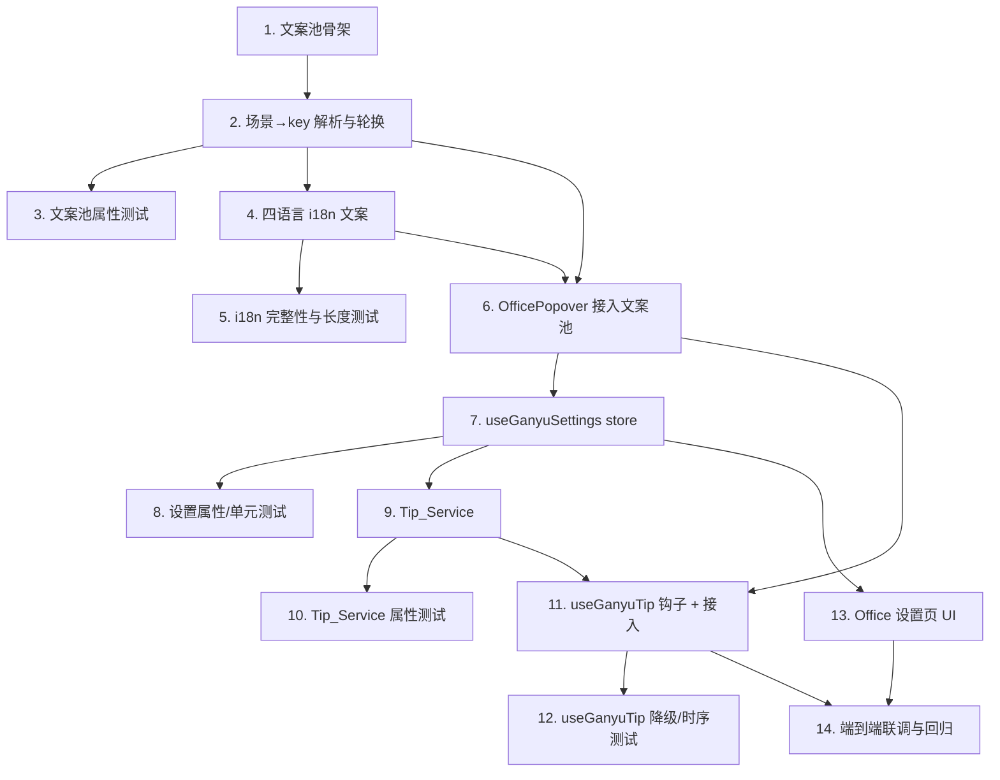

# Implementation Plan

## Overview

本计划将 `ganyu-companion-messages` 功能拆分为可增量实现的任务,分两个阶段:

- **阶段一(静态甘雨话术,需求 1–6)**:永远可用的地基层。包含文案池模块 `ganyuCopy.ts`、四语言 i18n 文案、以及 `OfficePopover` 接入。必须完整可用后才进入阶段二。
- **阶段二(AI 个性化提示,需求 7–10)**:可选增强层,构建于阶段一之上。包含 `useGanyuSettings`、`tipService.ts`、`useGanyuTip` 钩子、设置 UI 与降级联调。

约定:
- 文案撰写遵循角色 Skill 文档 `.kiro/steering/ganyu-persona.md` 与 design.md「两条消息路径与示例文案」。
- 属性测试使用 fast-check + Vitest,每条属性单独一个测试、≥100 次迭代(`{ numRuns: 100 }`),注释标注格式:
  `// Feature: ganyu-companion-messages, Property {number}: {property_text}`

## Tasks

### 阶段一 · 静态甘雨话术(需求 1–6)

- [x] 1. 建立文案池模块骨架 `src/ui/office_popover/ganyuCopy.ts`
  - 定义 `TimeSegment` 类型与 `CopyScene` 联合类型(覆盖 greet/phaseLabel/subtitleIdlePending/subtitleDefault/todoCelebrate/todoEmpty/focusStart/focusBreak/longWorkCare/onboardGreet/onboardHint 及控件/占位/统计标签场景)
  - 实现 `getTimeSegment(hour)`,保留现有边界 5/11/14/18(0–4 凌晨、5–10 早上、11–13 中午、14–17 下午、18–23 晚上)
  - _Requirements: 2.6, 1.3_

- [x] 2. 实现场景→key 解析与轮换逻辑
  - 实现 `sceneKeys(scene)`:对任意合法场景返回非空、稳定有序的 i18n key 列表
  - 实现 `pickKey(keys, seed?)` 轮换/随机选取(seed 便于测试可重现)与 `resolveCopy(scene, t, seed?)` 便捷封装
  - 保证 `resolveCopy` 永远返回非空字符串
  - _Requirements: 1.1, 1.2, 6.1, 6.5_

- [x] 3. 编写阶段一的属性测试(文案池)
  - Property 1:任意 `CopyScene` 下 `sceneKeys` 非空且 `resolveCopy` 返回非空字符串
  - Property 2:`getTimeSegment(hour)` 对 `hour∈[0,23]` 落入正确区间且 greet 场景文案非空(覆盖边界 0/4/5/10/11/13/14/17/18/23)
  - `getTimeSegment` 边界点示例单元测试
  - _Requirements: 2.1, 2.2, 2.3, 2.4, 2.5, 2.6, 3.1, 3.2, 3.3, 3.4, 4.1, 4.2, 4.3, 4.4, 4.5, 5.1, 5.2, 5.3_

- [x] 4. 在四个 i18n 资源中加入甘雨文案条目
  - 向 `src/locale/{en,kh,zh-CN,zh-TW}/translation.json` 添加 design.md 定义的全部 `ganyu.*` key,zh-CN 写入示例甘雨文案(每个问候/事件场景 ≥3 变体,阶段标签 ≥2),其余语言补齐对应翻译
  - key 一一对应,确认 i18next `fallbackLng:'en'` 生效
  - 所有静态文案 ≤30 汉字、第二人称「你」/第一人称「我」、温柔陈述语气(对照 ganyu-persona.md)
  - _Requirements: 1.1, 1.2, 1.4, 1.5, 6.2, 6.3, 6.5_

- [x] 5. 编写 i18n 完整性与长度属性测试
  - Property 4:文案池声明的每个 key 在 en/kh/zh-CN/zh-TW 中均存在且非空(直接读取四个 translation.json 断言)
  - Property 3(静态部分):任意合法场景的静态文案长度 ≤30 汉字
  - i18next 缺 key 回退 en 的示例测试
  - _Requirements: 1.5, 6.2, 6.3, 6.5_

- [x] 6. 将 `OfficePopover.tsx` 接入文案池
  - 用 `resolveCopy` 替换现有硬编码的时段问候、阶段标签、空状态、副标题(含 idle 有未完成待办引导)、引导页问候与提示、控件 title/placeholder、底部统计标签
  - 完成任务赞美(todoCelebrate)文案接入
  - 保持现有 i18n `t()` 机制,不破坏多语言;切换语言下次渲染即生效
  - _Requirements: 1.1, 3.1, 3.2, 3.3, 3.4, 4.1, 4.2, 4.3, 4.4, 4.5, 5.1, 5.2, 5.3, 6.1, 6.4_

### 阶段二 · AI 个性化提示(需求 7–10,构建于阶段一之上)

- [x] 7. 新增 Ganyu 设置 store `src/hooks/useGanyuSettings.tsx`
  - 定义 `GanyuSettings`(aiEnabled 默认 false、endpoint、apiKey、model?、timeoutMs 默认 8000、longWorkThresholdSeconds、disclosureShown)
  - 实现 `loadSettings/updateSettings/enableAi/maskedApiKey`,持久化到 `settings.json` 的 `ganyu` 段(沿用 getAppSettings/setConfig)
  - `enableAi` 在本地存储不可用时拒绝启用并保持 aiEnabled=false
  - _Requirements: 8.1, 8.5, 8.6, 8.7, 10.2_

- [x] 8. 编写设置相关属性/单元测试
  - Property 7:`maskedApiKey()` 不等于原 key 且不含完整连续明文(至多暴露尾部少量字符)
  - 默认 aiEnabled=false、首启说明状态机(disclosureShown 仅首次启用置位)、存储失败阻止启用的单元测试
  - _Requirements: 8.1, 8.3, 8.4, 8.6, 8.7_

- [x] 9. 实现 Tip_Service `src/services/tipService.ts`
  - 定义 `TipContext`/`TipResult`;实现 `serializeContext`(隐私边界:仅 todo 文本+完成态、今日番茄数/专注秒数、当前阶段、已完成番茄数、连续专注时长、时段与时间)
  - 实现 `buildPrompt(ctx)`:system prompt 注入甘雨人设+≤30汉字+人称/语气约束(依据 ganyu-persona.md);user prompt 仅含约定字段
  - 实现 `generateTip(ctx, settings, signal)`:aiEnabled=false→`disabled` 且零请求;缺配置→`no_config`;仅向 `settings.endpoint` 发送;含 AbortController+timeout;成功响应取首非空行、去引号、>30汉字截断,空响应→`bad_response`;不抛异常
  - _Requirements: 7.1, 7.2, 7.3, 7.5, 8.2, 8.8, 9.3, 10.1, 10.2_

- [x] 10. 编写 Tip_Service 属性测试
  - Property 5:aiEnabled=false 时零网络请求且返回 `disabled`
  - Property 6:启用时请求 URL 恒等于 `settings.endpoint`
  - Property 8:`buildPrompt(ctx).user` 含且仅含约定上下文字段(无设备标识/路径)
  - Property 3(AI 部分):任意模型返回字符串经裁剪后 ≤30 汉字
  - Property 11:任意 `timeoutMs>0` 仍发起请求,超时返回 `timeout`
  - Property 13:单次打开内相同上下文指纹连续 N 次仅 1 次网络调用(去重)
  - 网络层用 `vi.fn()` mock,统计调用次数与 URL
  - _Requirements: 7.1, 7.2, 7.5, 8.2, 8.8, 10.2, 10.4_

- [x] 11. 实现 `useGanyuTip` 钩子并接入 OfficePopover
  - 钩子参数 `{ enabled, scene, buildContext, fallback }`;初始 `text===fallback`(先静态),成功后覆盖为裁剪后 AI_Tip
  - 打开面板与阶段切换触发请求;相同上下文指纹去重;卸载/关闭时 abort 并忽略迟到结果
  - 任意失败/未启用→保持 fallback;在 OfficePopover 中以阶段一静态文案作为 fallback 接入(问候/副标题等贴心提示位)
  - _Requirements: 9.1, 9.2, 9.4, 9.5, 10.1, 10.3, 10.4_

- [x] 12. 编写 useGanyuTip 降级/时序属性测试
  - Property 9:任意失败/未启用情形最终展示文本恒等于非空 fallback
  - Property 10:初始展示等于 fallback,AI 成功返回非空后更新为裁剪后 AI_Tip
  - Property 12:pending 期间 abort 则忽略结果、保持 fallback
  - 打开面板/阶段切换各触发一次请求的示例测试
  - _Requirements: 9.1, 9.2, 9.3, 9.4, 9.5, 10.3_

- [x] 13. 在 Office 设置页加入 Ganyu AI 设置 UI
  - 启用开关(默认关)、端点、API key(掩码回显)、超时、长时间工作阈值输入
  - 首次启用时展示数据使用说明(列出将发送的本地数据字段),且仅首次展示
  - 长时间工作关心场景接入阈值判断(continuousFocusSeconds ≥ longWorkThresholdSeconds)
  - _Requirements: 7.3, 7.4, 8.1, 8.3, 8.4, 8.5, 8.6_

- [x] 14. 端到端联调与回归
  - 验证:未配置/未启用时面板全程使用阶段一静态话术;启用并配置后打开面板与阶段切换出现 AI 贴心提示;断网/超时/错误无缝回落静态;多语言切换正常
  - 运行全部属性测试(≥100 次/条)与单元测试,清理临时文件
  - _Requirements: 9.3, 9.4, 9.5, 10.1_

## Task Dependency Graph



```json
{
  "waves": [
    { "wave": 1, "tasks": ["1"] },
    { "wave": 2, "tasks": ["2"] },
    { "wave": 3, "tasks": ["3", "4"] },
    { "wave": 4, "tasks": ["5", "6"] },
    { "wave": 5, "tasks": ["7"] },
    { "wave": 6, "tasks": ["8", "9", "13"] },
    { "wave": 7, "tasks": ["10", "11"] },
    { "wave": 8, "tasks": ["12"] },
    { "wave": 9, "tasks": ["14"] }
  ]
}
```

## Notes

- 阶段一为强前置:任务 1–6 完成并验证后,面板必须能完全依赖静态甘雨话术正常工作,阶段二才开始。
- 阶段二的所有 AI 路径在任何失败/未启用情形下都回落到阶段一静态文案(对应 Property 9),保证面板始终可用。
- 隐私默认安全:`aiEnabled` 默认 false,未启用时不读取数据、不发网络请求;API key 仅本地存储且 UI 掩码。
- 所有任务仅涉及代码与测试实现;主观文案质量(温柔/贴心/单一意图)由人工审阅与 `ganyu-persona.md` 规范保证,不列入属性测试。
